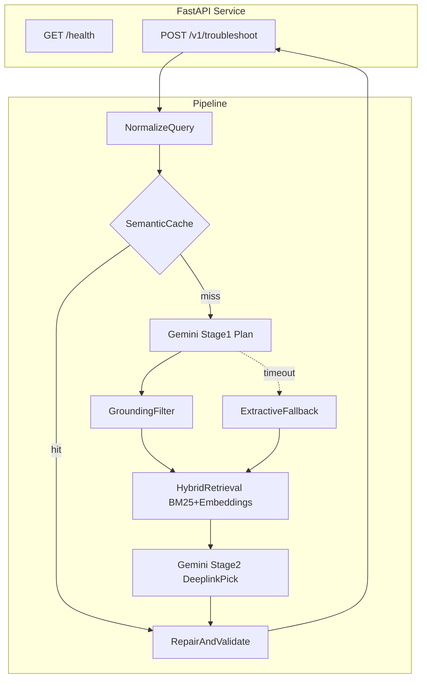

# Architecture Diagram

## Components

| Module | Role |
|--------|------|
| `app/cache.py` | Exact + embedding cache, warm-load from results.jsonl |
| `app/fallback.py` | SIIS Step parser, no LLM |
| `app/retrieval.py` | BM25 + MiniLM over deeplink catalog |
| `app/repair.py` | Schema rules, URL scrub, category order |
| `app/llm.py` | Gemini plan + deeplink selection |
| `scripts/eval_local.py` | G2-G5 gates, A1-A5 scoring |

## Data

- `data/deeplinks.json` — 578 masked URIs
- `data/siis_responses.json` — 20 training/eval scenarios
- `results.jsonl` — offline submission artifact
